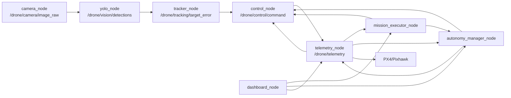

# Architecture Guide

This project is a ROS 2 drone stack built around one idea: keep the flight behavior conservative and observable. The current mission takes off, enters PX4 Offboard with a local-position hold, and yaws in place to center a detected target. Translation/orbit features exist as later mission scaffolding, but the default flight behavior is position-hold plus yaw.

## Big Picture

```text
Camera
  -> YOLO detector
  -> Tracker
  -> Mission/control logic
  -> MAVSDK/PX4 bridge
  -> Pixhawk

PX4 telemetry flows back into the mission, autonomy, control, dashboard, and diagnostics nodes.
```

The code is split so each node owns one kind of responsibility:

```text
drone_camera       Captures frames
drone_yolo         Finds candidate objects
drone_tracker      Picks/tracks the target and publishes image error
drone_control      Owns mission sequencing, safety gates, and control output
drone_telemetry    Owns the single MAVSDK/PX4 connection
drone_dashboard    Web dashboard and operator buttons
drone_diagnostics  Health monitor and heartbeat helpers
drone_bringup      Launch files and runtime parameters
drone_interfaces   Custom ROS messages
drone_fake         Simulation/fake data nodes
```

## Runtime Data Flow



Read the graph from left to right for vision and command flow. Read `telemetry_node` as the bridge in both directions: it publishes PX4 state into ROS and sends approved commands/actions back to PX4.

## Main Topics

| Topic | Type | Owner | Purpose |
|---|---|---|---|
| `/drone/camera/image_raw` | `sensor_msgs/Image` | `camera_node` | Raw camera frames |
| `/drone/vision/detections` | `DetectionArray` | `yolo_node` | YOLO detections |
| `/drone/tracking/target_error` | `TargetError` | `tracker_node` | Target lock, normalized image error, distance estimate |
| `/drone/telemetry` | `DroneTelemetry` | `telemetry_node` | PX4 connection, battery, altitude, attitude, local position, health |
| `/drone/mission/request` | `std_msgs/Bool` | Dashboard/operator | Start or stop the smart mission |
| `/drone/mission/state` | `std_msgs/String` | `mission_executor_node` | Current mission step and reason/blocker |
| `/drone/mission/command` | `MissionCommand` | `mission_executor_node` | High-level mission intent for control |
| `/drone/autonomy/request` | `std_msgs/Bool` | Mission/dashboard/operator | Requests autonomy permission |
| `/drone/autonomy/enabled` | `std_msgs/Bool` | `autonomy_manager_node` | Allows control node to produce approved motion |
| `/drone/mavsdk/offboard_request` | `std_msgs/Bool` | Mission/dashboard/operator | Requests PX4 Offboard executor |
| `/drone/mavsdk/offboard_enable` | `std_msgs/Bool` | `autonomy_manager_node` | Allows MAVSDK bridge to start/send Offboard |
| `/drone/control/command` | `ControlCommand` | `control_node` | Final position-hold/yaw command |
| `/drone/mavsdk/action_command` | `MavsdkActionCommand` | Mission/dashboard | One-shot TAKEOFF, HOLD, LAND, RTL, DO_ORBIT requests |
| `/drone/mavsdk/command_status` | `std_msgs/String` | `telemetry_node` | What the MAVSDK bridge accepted, blocked, or sent |

## Mission Flow

The normal pilot flow is:

```text
System Ready -> Start Mission -> Abort/Hold or Land
```

`System Ready` requests autonomy readiness. `Start Mission` publishes `/drone/mission/request=true`, then `mission_executor_node` owns this sequence:

```text
PREFLIGHT -> TAKEOFF -> PRIME_OFFBOARD -> TRACK_CENTER
```

The steps mean:

1. `PREFLIGHT`: require fresh telemetry, PX4 connection, and armed state.
2. `TAKEOFF`: request MAVSDK TAKEOFF to `takeoff_altitude_m`, currently `3.0 m`.
3. `PRIME_OFFBOARD`: request MAVSDK Offboard and publish hold setpoints before tracking begins.
4. `TRACK_CENTER`: keep the vehicle at the hold anchor and yaw toward the tracked target.

The mission waits for relative altitude to reach `airborne_altitude_m`, currently `2.7 m`, before it will prime Offboard. That prevents yaw tracking from starting while the vehicle is still on the ground or barely climbing.

### Plan-driven sequencing

This sequence is not hardcoded. `mission_executor_node` walks an ordered list of step "verbs" (takeoff, prime_offboard, track_center, approach, orbit, rtl, land, hold), dispatching each to a `_step_*` handler. The list comes from an optional external YAML plan (`mission_plan_file`), or a built-in default plan that reproduces the sequence above when no file is given.

```text
mission_plan.py            Plan model + YAML loader (no rclpy; unit-testable)
mission_executor_node.py   Walks plan.steps, one _step_* handler per verb
missions/*.yaml            Example/operator-authored plans
```

Key point: the plan only changes the *order and parameters* of steps. Each verb still runs the same primitive with the same safety gates (preflight checks, autonomy/offboard requests, the MAVSDK action gate). Adding or reordering steps cannot bypass a gate. See the README "Programming Missions" section for the schema. The mission state string the dashboard reads is unchanged.

## Safety Gates

The stack deliberately has more than one gate. That can feel redundant, but it makes failures easier to contain.

```text
Mission request
  -> mission_executor_node starts/stops the mission

Autonomy request
  -> autonomy_manager_node decides whether control output may be approved

MAVSDK Offboard request
  -> autonomy_manager_node decides whether PX4 Offboard sending may be enabled

MAVSDK action gate
  -> telemetry_node decides whether TAKEOFF/LAND/HOLD/RTL actions may reach PX4
```

Key rule: `control_node` does not talk to PX4. It only publishes `/drone/control/command`.

Key rule: `telemetry_node` owns the only MAVSDK/PX4 connection. This avoids multiple nodes fighting over the Pixhawk serial port.

Key rule: real TAKEOFF/LAND/HOLD/RTL actions are blocked unless `allow_mavsdk_actions` is true. For normal hardware bench work, leave that false.

## Position Hold And Yaw

The current control behavior is intentionally narrow:

```text
Hold local NED position + update yaw/yaw-rate toward target
```

The hold anchor is captured during `PRIME_OFFBOARD`, before target tracking fully takes over. Then, during `TRACK_CENTER`, `control_node` reuses that anchor and only changes yaw behavior.

This is the important mental model:

```text
Mission primes Offboard
  -> bridge/control capture local position anchor
  -> autonomy manager allows tracking when target/safety state passes
  -> control publishes POSITION command with same anchor and yaw correction
  -> telemetry bridge sends approved Offboard setpoint to PX4
```

So the drone should not chase the target with forward/right movement in the current default setup. It should hold position and rotate.

## What The Dashboard Does

`dashboard_node` is an operator surface. It does not bypass the ROS safety model.

Buttons publish the same request topics you can publish from a terminal:

| Button | Effect |
|---|---|
| `System Ready` | Publishes `/drone/autonomy/request=true` |
| `Start Mission` | Publishes `/drone/mission/request=true` |
| `Abort / Hold` | Stops mission/autonomy/offboard requests, then requests HOLD through the MAVSDK action path |
| `Land` | Stops mission/autonomy/offboard requests, then requests LAND through the MAVSDK action path |

The preflight panel is a fast status readout for telemetry freshness, PX4 link, armed state, battery, local position validity, vision freshness, and target lock. It is not a separate controller; it is a view of the same ROS data the mission/control stack is using.

## Debugging Model

Use three layers when debugging:

```text
Dashboard preflight: quick live status
Event logs: mission diary
Rosbag: raw black-box recording
```

Event logs live at:

```text
~/drone_mission_logs/mission_events_*.jsonl
```

They answer questions like:

- Did the mission start?
- Which state did it enter?
- Did it request TAKEOFF?
- Was it blocked by telemetry, arm state, altitude, or target lock?

Rosbags answer deeper questions because they store the raw ROS messages. Enable them from launch:

```bash
ros2 launch drone_bringup full_system_launch.py \
  record_bag:=true \
  bag_output:=bags/field_test_001
```

Use a new `bag_output` path each run. The default bag list avoids raw image frames to keep disk usage reasonable.

## Common Failure Paths

If takeoff does not happen:

- Check `allow_mavsdk_actions:=true` for SITL/dev action testing.
- Watch `/drone/mavsdk/command_status`.
- Confirm PX4 is connected and armed.
- Check `/drone/mission/state` for `PREFLIGHT` or `TAKEOFF` blockers.

If Offboard starts too early:

- Confirm `takeoff_altitude_m: 3.0`.
- Confirm `airborne_altitude_m: 2.7`.
- Watch `/drone/mission/state`; it should report altitude while waiting in `TAKEOFF`.

If yaw does not move:

- Check `/drone/tracking/target_error` is fresh and `tracking_state` is `LOCKED`.
- Check `/drone/autonomy/state` reaches `TRACKING`.
- Check `/drone/mavsdk/offboard_enable` is true.
- Check `/drone/control/command` has `command_type: POSITION`, `position_valid: true`, and `executed: true`.
- Check `/drone/mavsdk/command_status`.

## Where To Change Things

| Goal | File |
|---|---|
| Change flight/mission sequence | `src/drone_control/drone_control/mission_executor_node.py` |
| Change safety gate decisions | `src/drone_control/drone_control/autonomy_manager_node.py` |
| Change yaw/hold control behavior | `src/drone_control/drone_control/control_node.py` |
| Change PX4/MAVSDK bridge behavior | `src/drone_telemetry/drone_telemetry/telemetry_node.py` |
| Change dashboard UI/API | `src/drone_dashboard/drone_dashboard/dashboard_node.py` |
| Change launch arguments/nodes | `src/drone_bringup/launch/full_system_launch.py` |
| Change normal runtime parameters | `src/drone_bringup/config/full_system_params.yaml` |
| Change custom message fields | `src/drone_interfaces/msg/` |

## Related Docs

- `README.md`: setup, launch, quick commands
- `AUTONOMY_GATING.md`: safety gate details
- `MAVSDK_COMMAND_BRIDGE.md`: PX4 bridge behavior
- `DASHBOARD.md`: dashboard usage
- `DIAGNOSTICS.md`: health monitor and topic debugging
- `POSITION_HOLD_YAW_CHANGELOG.md`: position-hold/yaw change history
